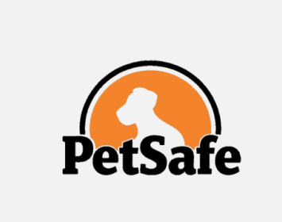
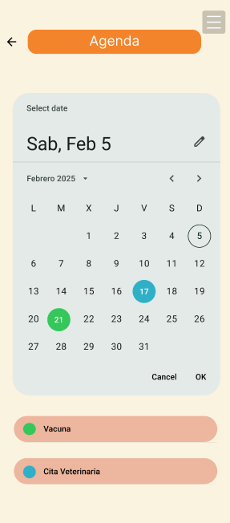
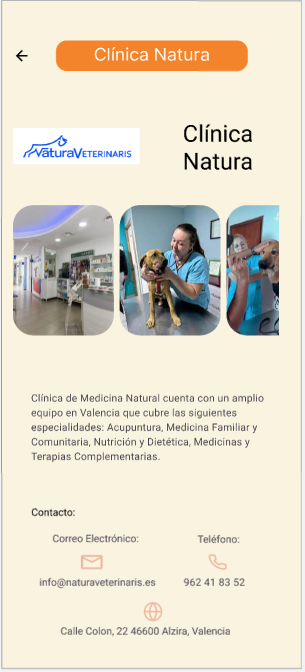

# 🐾 PetSafe

**PetSafe** es una aplicación diseñada para brindar seguridad, conexión y apoyo a toda la comunidad amante de los animales. Con un enfoque integral, PetSafe ayuda a los usuarios a encontrar mascotas perdidas, descubrir negocios pet-friendly, conectar con veterinarios y protectoras, y organizar mejor los cuidados de sus animales.

---

## 🚀 Funcionalidades principales

### 📍 Mapa Localizador de Mascotas Perdidas
Los usuarios pueden reportar mascotas perdidas y visualizar en un mapa interactivo su última ubicación conocida. También pueden compartir información relevante como fotos, características distintivas y recompensas.

### 🐕‍🦺 Negocios Pet-Friendly
Los negocios que aceptan mascotas pueden registrarse y promocionar sus servicios en la app, haciéndose visibles para una comunidad activa y comprometida con el bienestar animal.

### 🩺 Veterinarios
Clínicas y profesionales veterinarios pueden unirse a PetSafe para ofrecer sus servicios, publicar horarios, promociones, e incluso brindar atención de urgencia a través del directorio de la aplicación.

### 🏠 Protectoras de Animales
Las protectoras tienen su espacio para publicar fotos y descripciones de animales en adopción, facilitando el proceso de encontrar un nuevo hogar a los peludos rescatados.

### 📆 Calendario de Cuidados
Los usuarios cuentan con un calendario interactivo donde pueden anotar:
- Fechas de vacunación
- Citas veterinarias
- Eventos pet-friendly
- Recordatorios de cuidados diarios

---

## 🛠️ Tecnologías utilizadas

- **Lenguaje de programación:** Java
- **Framework de interfaz gráfica:** JavaFX
- **Base de datos:** SQL (puede integrarse con MySQL, mariadb)
- **Conexión a la base de datos:** JDBC
- **Manejo de fechas y eventos:** Java Calendar / LocalDate API
- **Geolocalización**: Google Maps API / OpenStreetMap
---

## 👥 Público objetivo

- Dueños de mascotas
- Negocios y locales pet-friendly
- Veterinarios y clínicas
- Protectoras de animales

---

## 💡 Objetivo

Crear una red colaborativa para mejorar la seguridad, el bienestar y el cuidado de las mascotas, promoviendo la responsabilidad compartida entre usuarios, negocios y profesionales del sector.

---

## 📸 Capturas de pantalla

---

## 📲 Descarga

Próximamente disponible en:
- [Google Play Store](#)
- [Apple App Store](#)

---

## 🤝 Contribuciones

¿Quieres aportar a PetSafe? ¡Eres bienvenido!
1. Haz un fork del repositorio.
2. Crea una nueva rama (`feature/nueva-funcionalidad`)
3. Haz tus cambios y haz commit (`git commit -m 'Añade nueva funcionalidad'`)
4. Sube la rama (`git push origin feature/nueva-funcionalidad`)
5. Abre un Pull Request

---

## 🐶 Hecho por Ali Zegaa Alos, Borja Pardo Juanes, Andrea Rubio Alfonso, Cristina Verdú Gimenez, Raúl Vidal Vallés, Edgar Martínez Palacios.
